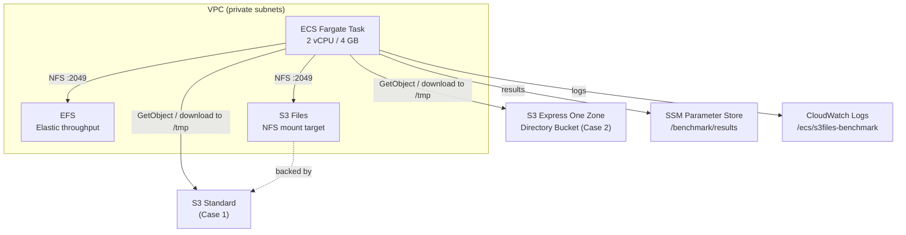

# aws-s3-files-performance-test-cdk

[](https://github.com/your-org/aws-s3-files-performance-test-cdk/actions/workflows/lint.yml)
[](LICENSE)

Benchmark tool that evaluates four AWS file-storage access patterns from an ECS Fargate task across three dimensions: **performance**, **operations**, and **cost**.

## Benchmark Cases

| # | Storage | Access Pattern | Key Question |
|---|---------|---------------|--------------|
| 1 | **S3 Standard** | Download to `/tmp` → local R/W | Baseline throughput with multi-AZ durability |
| 2 | **S3 Express One Zone** | Download to `/tmp` → local R/W | Single-digit ms download vs. Standard |
| 3 | **EFS** | Direct NFS mount R/W | POSIX semantics; shared file system latency |
| 4 | **S3 Files** | Direct NFS mount R/W | File system interface over S3; no local copy |

Each case runs **10 iterations** per file size (configurable via `FILE_SIZES_MB`), recording per-iteration download time, read throughput, write throughput, and P95/P99 latency.

> **Note — S3 Files (Case 4):** CDK does not yet have L2 support for S3 Files (as of 2026-04).
> The file system is provisioned separately via `scripts/setup_s3files.sh` and then
> wired into the ECS task with `--context s3files_fs_id=fs-xxxx`.
> Cases 1–3 work without this step; Case 4 is skipped when the context is absent.

## Architecture



## Evaluation Dimensions

### Performance

- **Download time** – time to transfer the test file from S3 to `/tmp` (Cases 1 & 2 only)
- **Read throughput** – MB/s for sequential read
- **Write throughput** – MB/s for sequential write
- **P95 / P99 latency** – tail latency across iterations

### Operations

- **Cases 1 & 2** – stateless; no persistent mount; works with any ECS task
- **Cases 3 & 4** – NFS mount lifecycle managed by ECS; POSIX-compatible file I/O
- **Availability** – S3 Standard / EFS are multi-AZ; Express One Zone / S3 Files are single-AZ

### Cost (approximate, Tokyo ap-northeast-1)

| Storage | Per GB-month | Per GET | Per PUT | Notes |
|---------|-------------|---------|---------|-------|
| S3 Standard | $0.025 | $0.00037/1k | $0.0047/1k | Multi-AZ |
| S3 Express One Zone | $0.16 | $0.002/1k | $0.005/1k | Single-digit ms |
| EFS Elastic | $0.043 | — | — | + $0.06/GB transferred |
| S3 Files | TBD (new service) | — | — | NFS over S3 |

## Prerequisites

| Tool | Version |
|------|---------|
| Python | 3.12+ |
| Node.js | 20+ |
| AWS CDK CLI | v2 (`npm install -g aws-cdk`) |
| Docker | 24+ |
| AWS CLI | v2, configured with appropriate permissions |

The deploying IAM principal needs permissions for: CloudFormation, EC2, ECS, EFS, S3, S3Express, IAM, Lambda, SSM, CloudWatch Logs, ECR.

## Deployment — Four Phases

S3 Files requires a manual CLI step because CDK has no L2 support for the service yet.
Cases 1–3 are available after Phase 1 alone.

```
Phase 1  cdk deploy                              → Cases 1-3 ready
Phase 2  bash scripts/setup_s3files.sh           → creates FS + mount target
Phase 3  cdk deploy --context s3files_fs_id=...  → Case 4 ready
Phase 4  bash scripts/run_task.sh                → run benchmark
```

---

### Phase 0 — One-time setup

```bash
git clone https://github.com/your-org/aws-s3-files-performance-test-cdk.git
cd aws-s3-files-performance-test-cdk

# Create and activate a virtual environment
python -m venv .venv
source .venv/bin/activate          # macOS / Linux
# .venv\Scripts\activate.bat       # Windows (Command Prompt)
# .venv\Scripts\Activate.ps1       # Windows (PowerShell)

pip install -r requirements.txt
```

Verify the install:

```bash
python -c "import aws_cdk; print(aws_cdk.__version__)"
```

Bootstrap CDK (first time per account/region):

```bash
export JSII_SILENCE_WARNING_UNTESTED_NODE_VERSION=1   # suppress noisy warning
cdk bootstrap --region ap-northeast-1
```

---

### Phase 1 — Deploy base infrastructure (Cases 1–3)

```bash
cdk deploy --region ap-northeast-1
```

Docker must be running; CDK builds and pushes the benchmark image to ECR.
After this deploy, Cases 1, 2, and 3 are fully operational. Case 4 is skipped.

---

### Phase 2 — Create S3 Files file system (Case 4 prerequisite)

```bash
bash scripts/setup_s3files.sh ap-northeast-1
```

The script reads CDK stack outputs and runs these CLI commands automatically:

| Step | Command |
| ---- | ------- |
| Create FS | `aws s3files create-file-system --bucket ... --role-arn ...` |
| Wait (MT ready) | Retry `create-mount-target` until `ConflictException` stops |
| Create MT | `aws s3files create-mount-target --subnet-id ... --security-group ...` |
| Wait (available) | Poll `aws s3files list-mount-targets` |

On completion the script prints the file system ID and the Phase 3 command:

```
File system ID : fs-0123456789abcdef0

>>> Phase 3 — add S3 Files volume to ECS task and redeploy:

    cdk deploy --context s3files_fs_id=fs-0123456789abcdef0 --region ap-northeast-1
```

---

### Phase 3 — Wire S3 Files into the ECS task (enables Case 4)

Copy the command printed by Phase 2 and run it:

```bash
cdk deploy --context s3files_fs_id=fs-0123456789abcdef0 --region ap-northeast-1
```

This updates the ECS task definition to:

- Add an S3 Files NFS volume (`/mnt/s3files`)
- Grant `elasticfilesystem:ClientMount/Write/RootAccess` on the file system
- Set `S3FILES_ENABLED=1` so the benchmark runs Case 4

---

### Phase 4 — Run the benchmark

```bash
bash scripts/run_task.sh ap-northeast-1
```

The ECS task runs all four cases and saves results to SSM Parameter Store.
Estimated duration: ~10 min for 100 MB, longer for larger file sizes.

### Example output

```
==========================================================================
  BENCHMARK RESULTS — 100MB
==========================================================================
Case                                       AvgRead   AvgWrite    P95R    P95W  DL avg
--------------------------------------------------------------------------
Case1 Standard-S3 → /tmp               1024.3MB/s   980.1MB/s    98ms   102ms   850ms
Case2 S3-Express-OneZone → /tmp        1180.5MB/s   980.1MB/s    45ms   102ms   320ms
Case3 EFS-direct                         112.4MB/s    98.6MB/s   910ms   980ms     0ms
Case4 S3-Files-direct                    198.7MB/s   185.3MB/s   510ms   540ms     0ms
```

> Results vary by instance placement, VPC routing, and EFS/S3 Files throughput mode.

## Project Structure

```
.
├── benchmark/                  # Containerised benchmark application
│   ├── benchmark.py            # Main benchmark script (4 cases)
│   ├── Dockerfile
│   ├── requirements.txt
│   └── .dockerignore
├── infra/                      # AWS CDK stack
│   ├── __init__.py
│   └── stack.py
├── scripts/
│   ├── run_task.sh             # Phase 4: launch ECS task & print results
│   ├── setup_s3files.sh        # Phase 2: create S3 Files FS + mount target
│   ├── teardown_s3files.sh     # Delete S3 Files resources before cdk destroy
│   ├── recover_failed_stack.sh # Recover a stack stuck in DELETE_FAILED
│   └── print_results.py        # Format SSM result JSON as a table
├── .github/
│   ├── ISSUE_TEMPLATE/
│   └── workflows/
│       └── lint.yml
├── app.py                      # CDK entry point
├── cdk.json
├── requirements.txt            # CDK dependencies
├── CHANGELOG.md
├── CONTRIBUTING.md
└── LICENSE
```

## Customisation

| Parameter | Default | How to change |
| --------- | ------- | ------------- |
| File sizes | `100,1024,10240` MB | `FILE_SIZES_MB` env var in `infra/stack.py` |
| Iterations | `10` | `ITERATIONS` constant in `benchmark/benchmark.py` |
| Task CPU | `2048` | `cpu` in `FargateTaskDefinition` (`infra/stack.py`) |
| Task memory | `4096` MiB | `memory_limit_mib` in `FargateTaskDefinition` |

## Cleanup

**Important:** delete the S3 Files file system before running `cdk destroy`,
otherwise the S3 bucket deletion will fail with a 409 error.

```bash
# Step 1: delete S3 Files resources
bash scripts/teardown_s3files.sh ap-northeast-1 fs-0123456789abcdef0

# Step 2: destroy the CDK stack
cdk destroy --region ap-northeast-1
```

`cdk destroy` removes all remaining resources. EFS data and S3 objects are
deleted automatically because `RemovalPolicy.DESTROY` is set.

## Troubleshooting

| Symptom | Cause | Fix |
| ------- | ----- | --- |
| Stack stuck in `DELETE_FAILED` | S3 Files FS still attached to bucket | Run `scripts/teardown_s3files.sh`, then `cdk destroy` |
| Stack stuck in `ROLLBACK_FAILED` | Same as above | Run `scripts/recover_failed_stack.sh` |
| `describe-file-systems` invalid | Not a valid `aws s3files` subcommand | Already handled in scripts; no action needed |
| Case 4 skipped in benchmark | `s3files_fs_id` context not set | Re-deploy with `--context s3files_fs_id=fs-xxxx` (Phase 3) |

## Contributing

See [CONTRIBUTING.md](CONTRIBUTING.md) for development setup, code style, and the pull request process.

## License

[MIT](LICENSE)
